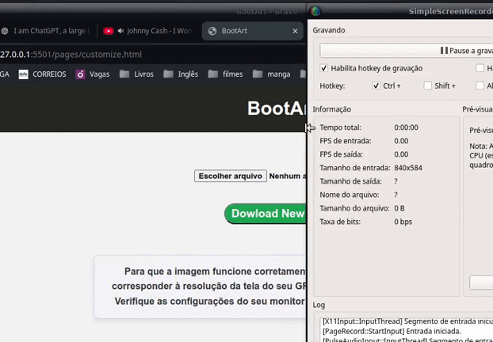

# BootArt

##    Transforme seu GRUB em uma obra de arte.
    
##    Turn your GRUB into a work of art.



Bem-vindo ao projeto de personalização do GRUB! Este site permite uma configuração visual e prática do GRUB para tornar seu bootloader do Linux único e funcional.

## Como Executar

Para garantir que o script funcione corretamente, você precisará dar permissão ao arquivo `install.sh` e então executá-lo com os seguintes comandos no terminal:

```bash
chmod 777 install.sh
./install.sh
